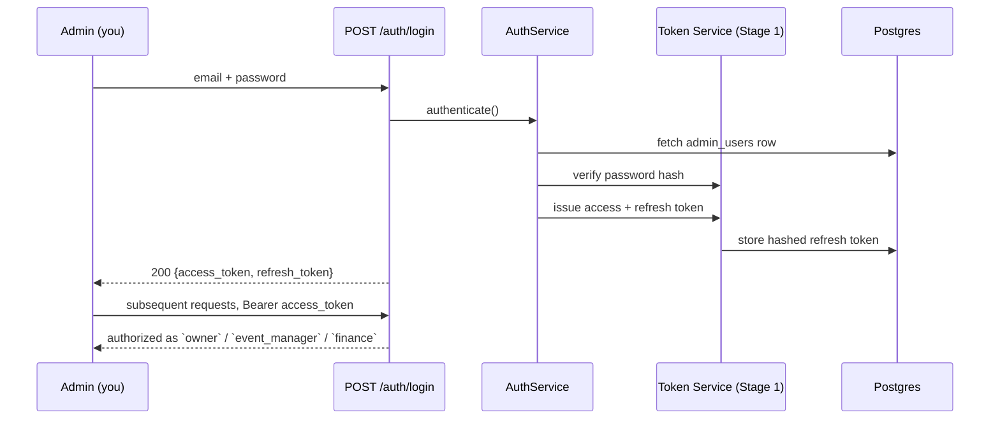

# TrailOps Backend — Implementation Plan

**Source of truth:** [`BACKEND_REQUIREMENTS.md`](../BACKEND_REQUIREMENTS.md)
**This document:** sequencing, not requirements — it says *when* and *in what order*, not *what*.
**Status:** Planning only. **Nothing in this document is implemented yet.** Build starts on explicit go-ahead, stage by stage.

---

## 1. What's actually being asked for right now

Two things, in this order, and nothing further until each is reviewed:

1. **Stage 1 — the JWT/Token Service.** Built as a standalone, framework-agnostic module from day one, specifically so it can be lifted out into its own microservice later without touching its callers. Full design: [`jwt-service.md`](../jwt-service.md).
2. **Stage 2 — Admin login.** `POST /auth/login|refresh|logout`, wired to Stage 1's token engine, ending with a working admin login.

Everything else in `BACKEND_REQUIREMENTS.md` §9 (events, bus routes, registrations, payments, waitlist, notifications, analytics, reviews) is real, sequenced below for visibility, and **not started**.

---

## 2. Why JWT is pulled out first, and why it's generic

The requirements brief has **two** distinct authentication surfaces, not one:

- **Admin auth** (§2): email + password → role-based session. This is the one being built first.
- **Participant lookup** (§2, §4): phone + OTP → *"a short-lived scoped token that grants access to that phone number's bookings only — nothing else."*

That second one is still a signed, verifiable, expiring token — the same primitive, with different claims and a different issuance trigger. Building the token engine generically now (subject-agnostic: "admin" or "participant", not hard-wired to `admin_users`) means the OTP flow — whenever it's built, per the requirements' own build order it's part of step 4, "Registrations" — plugs into the *same* engine instead of growing a second, parallel JWT implementation. This is spelled out in full in the LLD (§8.5 of that document shows the OTP flow reusing the engine unchanged).

It also happens to be the one component the brief implies might need to scale or move independently — auth is the thing every other request touches, so it's the natural first candidate for extraction if this ever needs to split into services. Designing for that now costs nothing extra; retrofitting it later would mean rewriting every caller.

---

## 3. Roadmap

```mermaid
flowchart LR
    S1["Stage 1\nJWT / Token Service\n(engine, no endpoints)"]
    S2["Stage 2\nAdmin login APIs\n/auth/login /refresh /logout"]
    S3["Stage 3\nFoundation rest\nconfig, health, audit log"]
    S4["Stage 4\nEvents\ntemplates, CRUD, publish, content"]
    S5["Stage 5\nBus routes\ncapacity enforcement"]
    S6["Stage 6\nRegistrations\n+ Participant OTP (reuses Stage 1)"]
    S7["Stage 7\nPayments\nRazorpay, refunds"]
    S8["Stage 8\nWaitlist\nSLA + promotion"]
    S9["Stage 9\nNotifications\nWhatsApp/SMS"]
    S10["Stage 10\nAnalytics & exports"]
    S11["Stage 11\nReviews"]

    S1 --> S2 --> S3 --> S4 --> S5 --> S6 --> S7 --> S8 --> S9 --> S10 --> S11

    style S1 fill:#2f6f5e,color:#fff,stroke:#1c4638
    style S2 fill:#2f6f5e,color:#fff,stroke:#1c4638
    style S3 fill:#eee,stroke:#999
    style S4 fill:#eee,stroke:#999
    style S5 fill:#eee,stroke:#999
    style S6 fill:#eee,stroke:#999
    style S7 fill:#eee,stroke:#999
    style S8 fill:#eee,stroke:#999
    style S9 fill:#eee,stroke:#999
    style S10 fill:#eee,stroke:#999
    style S11 fill:#eee,stroke:#999
```

Green = in scope now, being planned in this document in detail. Grey = acknowledged, sequenced per requirements §9, not detailed until we're closer — detailing them now would mean planning against assumptions that may shift once auth and events exist.

Stage 3 onward otherwise follows `BACKEND_REQUIREMENTS.md` §9's build order as-is; Stage 6 gets one addition noted (participant OTP) since it's the point where the second consumer of the Stage-1 token engine shows up.

---

## 4. Stage 1 — JWT / Token Service

**Goal:** a working, tested token engine with nothing wired to HTTP yet. No login endpoint exists after this stage — that's the point.

Full design: [`jwt-service.md`](../jwt-service.md) (the `lld/jwt-auth-service-lld.md` link this line used to point to was never created — `jwt-service.md` at repo root is the actual, current design doc; supersedes the deliverables list below wherever they disagree).

### Deliverables

| Item | Detail |
|---|---|
| `TokenServicePort`, `RefreshTokenStorePort`, `PasswordHasherPort` | Protocols — the extraction boundary everything else depends on. See `jwt-service.md` §1.1. |
| `JWTTokenService` | HS256 via `python-jose`; issue/verify/refresh/revoke. (Not RS256 — see the algorithm row in §7 below.) |
| `Argon2PasswordHasher` | `passlib[argon2]`; hash/verify/needs_rehash |
| ~~`RedisTokenBlacklist`~~ | Dropped — access tokens are stateless by design (no DB/Redis check per request); the 15-min TTL is the revocation mitigation. Only refresh tokens are revocable, via the DB tables below. See `jwt-service.md` §2.4. |
| `admin_users` model + migration | `password_hash`, never a raw password column |
| `admin_refresh_tokens` model + migration | stores a **hash** of the refresh token, same no-raw-secrets principle. (Not a single shared `refresh_tokens` table — participant sessions get their own `participant_sessions` table in Stage 6, per `jwt-service.md` §6.) |
| Startup schema bootstrap | Advisory-lock-guarded `alembic upgrade head` runner, gated by `AUTO_MIGRATE`, so a fresh prod DB gets its schema on first boot with no manual migration step. See `jwt-service.md` §7.5. |
| Unit tests | 100% coverage target on this module (auth sits in the same correctness tier as seat-locking per requirements §8) |

### Explicitly not in Stage 1

- No `/auth/*` router
- No `AuthService` orchestration
- No `get_current_admin` FastAPI dependency
- No participant/OTP code (`otp_codes`, `OtpService`) — that's Stage 6

### Why password + refresh-token hashing both matter here

The instruction was "password should not be stored raw" — this design applies the same rule one level further: refresh tokens are bearer secrets too (whoever holds one can mint new sessions), so they're hashed at rest the same way passwords are, not just passwords narrowly. See LLD §7.4 and §9.

---

## 5. Stage 2 — Admin login APIs

**Goal:** `POST /api/v1/auth/login` works end-to-end against a real admin user in the database. This is "my login for admin work."

### Deliverables

| Item | Detail |
|---|---|
| `AuthService` | email lookup → `PasswordHasherPort.verify()` → `TokenServicePort.issue_*()` |
| `POST /auth/login` | returns `{access_token, refresh_token}` |
| `POST /auth/refresh` | rotation, per LLD §8.3 |
| `POST /auth/logout` | revokes refresh token + blacklists current access token |
| `get_current_admin` dependency | resolves `Authorization: Bearer` → `TokenPayload` |
| `require_role(*roles)` dependency | per requirements §2 — `owner` / `event_manager` / `finance` |
| Seed step | create the first `owner` admin user (script or migration data seed — decide at build time) |
| Rate limiting on `/auth/login` | requirements §7 — brute-force protection lives at this layer, not in the token engine |
| Integration tests | full login → authenticated request → refresh → logout cycle |

### Sequence — what "my login for admin work" looks like end to end

---

## 6. Where participant OTP fits (for awareness, not built now)

Requirements §2 and §4 ask for phone+OTP lookup so participants can check seat/booking status without an account. That flow needs the **same** Token Service (issuing a scoped, non-refreshable token — LLD §7.1, §8.5) plus two new pieces that don't exist yet: `otp_codes` storage and an `OtpService` for send/verify. Per the requirements' own build order (§9 step 4, bundled with "Registrations"), this lands in **Stage 6**, after events and bus routes exist to have something to check status against. Called out here so Stage 1 isn't accidentally designed in a way that has to be reworked when it arrives — it already isn't (LLD §8.5 confirms the reuse).

### 6.1 Background jobs — hosting decision still open

`BACKEND_REQUIREMENTS.md` §1 specs "Celery + Redis" for background jobs: waitlist SLA expiry (§5.4 — auto-release an unpaid promoted seat after 24h and promote the next person), notification dispatch with SMS fallback (§5.6), report generation (§6). None of this is built yet — it lands with Stage 6 (waitlist) onward — but it's flagged here because it's a genuine open fork, not a default to just build against:

- Vercel (the confirmed frontend host, §9.4 in `jwt-service.md`) **cannot run a persistent Celery worker** — confirmed via Vercel's own docs on Functions/Cron, no long-running processes, ever. If the backend ends up Vercel-only, Celery as specified has to be redesigned away: Vercel Cron (Pro plan for sub-daily frequency) driving the SLA-expiry sweep instead of a queue consumer, and synchronous-in-request notification dispatch instead of an async queue. That's a real deviation from §1's stated stack, not just a hosting detail — costs some timing precision (cron-interval granularity instead of instant) and retry robustness (no proper retry queue).
- The alternative is one small always-on host (Render was the fallback discussed; Railway explicitly ruled out) running a real Celery worker, keeping the original design intact.

**Not decided as of 2026-08-17** — explicitly deferred until Stage 6 is actually being built, per the requirements doc's own "state a default, don't block" convention (§11), except here there wasn't yet a default worth locking in early. Revisit this section before starting Stage 6.

---

## 7. Decisions made now, flagged for confirmation

Mirroring the requirements doc's own convention (§11) of stating a default rather than blocking on an answer:

| Decision | Default chosen | Why |
|---|---|---|
| JWT algorithm | **HS256** (symmetric) — supersedes the RS256 default this row originally carried; see `jwt-service.md` §0, locked | A single shared secret (`JWT_SECRET_KEY`, secret-manager-held) rather than a keypair. Microservice-readiness is still handled — see `jwt-service.md` §1.1 — through a ports/adapters boundary rather than through the signing algorithm: extraction means distributing the same secret to the new service, not shipping a public key. |
| Password hashing | **Argon2id** via `passlib` | OWASP-recommended, memory-hard, resists GPU cracking better than bcrypt. |
| Refresh token storage | **Hashed (SHA-256), opaque random string, not a JWT** | Same "never raw" principle applied to a second bearer secret, not just the password. |
| Access token TTL | 15 min (admin), 60 min (participant, later) | Short enough to cap blast radius of "can't revoke a stateless JWT early." |
| Refresh token TTL | 7 days, rotated on every use, reuse triggers full revocation | Standard OAuth2 refresh-rotation practice. |
| Participant token refresh | **None** — re-verify OTP instead | Lookup-only session; simpler than a second refresh flow for a narrow use case. |

None of these block starting Stage 1 — they're defaults to build against, open for correction before or during review.

---

## 8. Sequencing rules carried over from the requirements brief

- One slice per PR, into `development`, never `main` (`BACKEND_REQUIREMENTS.md` header).
- Every model change ships an Alembic migration with both `upgrade` and `downgrade` (§10).
- No `TODO`s merged — open an issue instead (§10).
- Business logic in `services/`, routers stay thin (§1).
- Tests cover the happy path and every named failure mode (§10) — for Stage 1/2 that means: wrong password, expired token, tampered signature, revoked refresh token reused, wrong role on a protected route.

---

## 9. Explicit non-goals right now

- No events, bookings, payments, or any other domain model — those are Stage 4 onward.
- No participant-facing endpoints of any kind yet.
- No deployment/infra changes.
- **No code is written until Stage 1 is reviewed and approved to start.**

---

## 10. Next step

Review [`jwt-auth-service-lld.md`](lld/jwt-auth-service-lld.md) and this plan. On approval, Stage 1 is implemented first (engine + tests, no endpoints), reviewed, then Stage 2 (login APIs) follows.
